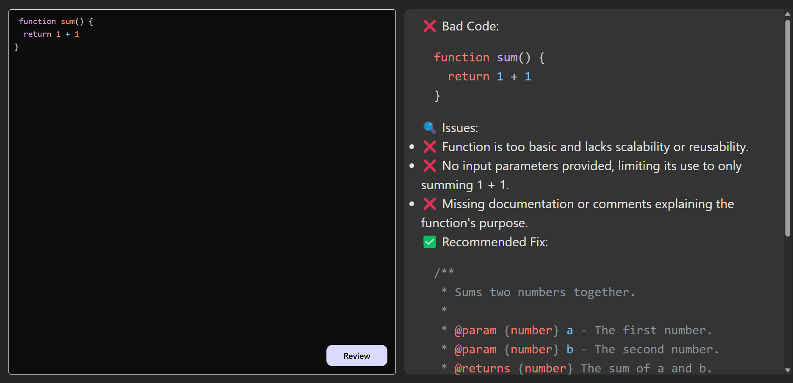

# Code Review with AI 🚀  

## Overview  
Code Review AI is a web application that helps developers analyze their code quality using Google's Gemini API.  
It reviews code, identifies potential mistakes, and provides feedback on improvements.  

## Features ✨  
- 📌 AI-powered code review  
- ✅ Identifies bad coding practices  
- 🔍 Suggests improvements  
- 🖥️ User-friendly frontend with Vite  
- ⚡ Fast and efficient Node.js backend  

## Tech Stack 🛠  
- **Frontend**: Vite, React  
- **Backend**: Node.js, Express  
- **AI API**: Gemini API  

Screenshots

Code Input Page

Review Result Page
